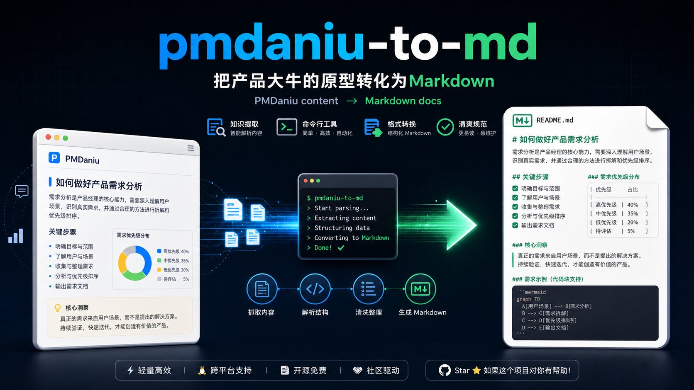

# pmdaniu-to-md

将产品大牛（pmdaniu.com）上的 Axure 原型文档转成结构化 Markdown。

适合团队把 PRD 原型文档喂给 AI 做 RAG 检索，或者整理成可协作的文档格式。

<p align="center">
  
</p>

## 快速开始

把这个 URL 发给你的 Agent（OpenClaw、MyAgents、Claude Code、Codex、Hermes 等），说：

```
帮我安装这个 skill: https://github.com/monsignorlaw1015/pmdaniu-to-md
```

Agent 会自动完成安装。安装后说"帮我把这个产品大牛文档转成 Markdown：https://u.pmdaniu.com/XXXXX"即可开始。

---

## 效果

- 线框图 + 便利贴标注 → 结构化 Markdown（忠实转录三原则：不编造、不猜测、校验数字）
- 自动处理多级页面树（文件夹 / 子页面）
- 自动识别并提取嵌入的飞书 / 腾讯文档
- **横向 + 纵向全尺寸截图**：Axure 无限画布不再截断（N×M 矩阵分段，20% 重叠）
- 便利贴箭头连线归属推断（位置邻近性 + 关键词匹配）
- 输出到 `outputs/产品大牛文档/{文档名}.md`

## 更新日志

### v1.0.1 (2026-06-05)

**修复：宽画布内容截断**
- Axure 无限画布可远超视口宽度（实测 3 倍+），旧版只截视口导致右边 ~70% 内容丢失（便利贴、手机预览、注释等）
- 根因：Axure 用 `#base` 绝对定位撑开画布，水平滚动容器是 mainFrame 内的 `documentElement`（非 body）
- 修复：截图逻辑从 `_screenshot_with_scroll()` 升级为 `_screenshot_fullpage()`，同时检测横向和纵向超出，自动执行 N×M 分段截图（先行后列，20% 重叠）

**新增：便利贴连线归属判断**
- Vision 能看到箭头存在和大致方向，但无法精确重建拓扑关系
- 新增归属推断规则：位置邻近性 + 文字关键词匹配目标控件
- 能确定归属的挂到对应控件下面作为子节，不确定的用 `[连线关联]` 标注
- 已记录到「已知局限」中，避免过度承诺

### v1.0.0 (2026-06-02)

初始版本：
- CDP 驱动 Chrome 打开产品大牛文档，自动处理 jump 页
- 通过 `$axure.document.sitemap` 获取完整页面树
- hash 导航逐页切换，纵向滚动截图（长页面不丢内容）
- 外嵌文档检测（data.js 正则匹配 URL）+ 独立 tab 截图
- 飞书文档虚拟滚动容器特殊处理
- Vision 多模态理解截图 → 结构化 Markdown 输出

---

## 前置条件

1. **支持工具调用的 AI Agent**（OpenClaw、MyAgents、Claude Code、Codex、Hermes 等均可）
2. **web-access skill**（提供 CDP Proxy，驱动 Chrome）
   ```bash
   git clone https://github.com/eze-is/web-access ~/.myagents/skills/web-access
   ```
   web-access 本身还需要：
   - **Node.js 22+**（https://nodejs.org）
   - **浏览器开启远程调试**：地址栏输入 `chrome://inspect/#remote-debugging`（Edge 用 `edge://inspect/#remote-debugging`），勾选 **Allow remote debugging for this browser instance**，可能需要重启浏览器

   > 首次运行时 Agent 会自动检测，缺少时给出安装引导
3. **Chrome / Edge** 已打开并登录产品大牛（pmdaniu.com）
4. **python3**（macOS 自带；其他系统从 https://python.org 安装）
5. 当前使用的 AI 模型具备视觉能力（能理解截图图片）

## 手动安装

```bash
git clone https://github.com/monsignorlaw1015/pmdaniu-to-md ~/.myagents/skills/pmdaniu-to-md
```

然后在你的工作区 `.claude/skills/` 下建软链接：

```bash
ln -sf ~/.myagents/skills/pmdaniu-to-md /path/to/your/workspace/.claude/skills/pmdaniu-to-md
```

## 已知局限

- **纯图片页**：无文字内容的图片展示页无法有效转换，Vision 会描述图片但无法还原业务语义，建议手动补充
- **流程图箭头关系**：Vision 能识别节点文字但无法精确重建箭头拓扑，仅输出节点顺序
- **便利贴连线归属**：能通过位置邻近性和关键词推断大部分情况，复杂交叉箭头可能误关联
- **嵌入文档需登录**：若飞书/腾讯文档是私有文档，需要 Chrome 中已登录对应账号，否则 embed tab 打开后是登录页
